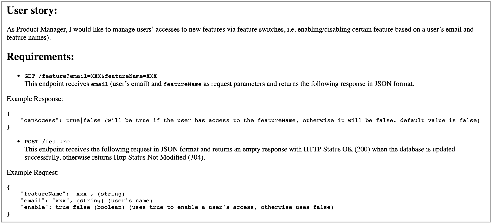
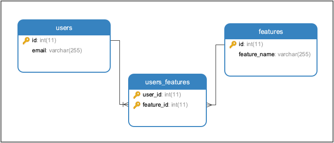

# Switch Access #

 

Demonstration of Requirements understanding, proposing a solution and implementation by using the latest tools and techniques.

### What is this repository for? ###

* This app is built as assignment for MoneyLion - KL. 
* Adds different libs to enhance the application quality and performance.
* Using [SWAGGER.IO](www.swagger.io) for documentation and as a working REST-API client
* CI/CD Demonstration using [Github Actions](https://github.com/features/actions)
* Docker containers are used for Build Deployment
* The live environment is established on an EC2 instance
* Version 1.0.0

### Problem Statement:

### Proposed Schema:

- By keep the provided instructions in mind, I would prefer to use a [Spring Boot](https://www.tutorialspoint.com/spring_boot/spring_boot_introduction.htm) application for the implementation of required functionality.
- H2 Database will be used for Dev, Test and Prod environments.
- For unit testing, I would prefer to use JUnit

#### Entities ####
- It is clear by the requirements that there will be `TWO` main entities
    * **User**
    * **Feature**
- In case of RDBMS, another entity will be required to save the relations/references between `User` and `Feauter`
    - This reference-table will help to reduce the duplications
    - It will also help to improve the data retrieval in case the database grows to a huge level 

### Proposed Schema:

### Deliverable Content ###

#### Functional Implementation ####
 * **GET** `{baseURL}/feature?email=abc@gmail.com&featureName=A/` - returns the `access` status as `true|false`
 * **POST** `{baseURL}/feature` - updates the access permission between user and feature provide in *Body* 
 ---
#### Non-Functional Implementation ####
 * **GET** `{baseURL}/api/user/all` - Returns all Users with their associated access features,
 * **GET** `{baseURL}/api/user/{email}` - Returns User with the provided `email` along with the associated access features,
 * **GET** `{baseURL}/api/feature/all` - Returns All features,
 * **GET** `{baseURL}/api/feature/{featureName}` - Returns a feature with the provided `featureName`
 
 
## How do I get set up? ##

### How to set up ###
To set-up the project locally you need to clone this repo, from `master` or `develop` branch or some latest `TAG`

### Configuration ###
- Please sync and resolve the `maven` dependencies
- Run `mvn clean install`
- To run tests `mvn clean test`

##### Build Docker Image
- `docker build -t switch-access .`

##### Run Docker Image
- Run `docker run -d -p 80:8080 switch-access`
- You may access the running docker app on [`http://localhost/swagger-ui.html`](http://localhost/swagger-ui.html)

##### Stop Docker Container
- Run `docker kill {container-id}`

### Pre-reqs
- JDK 1.8
- Spring Boot
- Docker
- H2
- Junit
- IntelliJ IDEA

### Tools Included
- Jacoco
- Sonar
- Swagger
- JPA
- Hibernate

#### Auth ####
- No auth is used for this version, thouhg we have a structure to implement along with swagger documentation

## External Tools: ##

- **[Github Actions](https://github.com/features/actions)**
- **[Docker](https://www.docker.com/)**:
- **[SonarCould](https://sonarcloud.io/)**:

## Deployment

- When a `pull request` is merged in `master`, `Github Action` starts and following steps are done by automated CI/CD:
    - Creates Environment and Runs all tests
    - Complete a SonarQube analysis and pushes the results to **[Live Project](https://sonarcloud.io/dashboard?id=naeemark_SwitchAccess)**
    - Makes a deployment to Github packages (Mock)
    - Creates the Docker Image and pushes to [Docker Repository](https://hub.docker.com/repository/registry-1.docker.io/naeemark/assessment)
    
- As a next step, login to ec2 instance using ssh and pull the latest Docker Image and start a new container

## Distribution ##

 - [Swagger API Docs](http://ec2-54-251-176-193.ap-southeast-1.compute.amazonaws.com/swagger-ui.html)
 - A [Postman Collection](https://www.getpostman.com/collections/01221eb5bd755dd9295e) is available for all the API's (live).
 - A [docker repository](https://hub.docker.com/repository/registry-1.docker.io/naeemark/assessment) is created, latest image can be downloaded
 - **[Sonar Project](https://sonarcloud.io/dashboard?id=naeemark_SwitchAccess)**

## Contribution guidelines ##

- Forks are always appreciated

